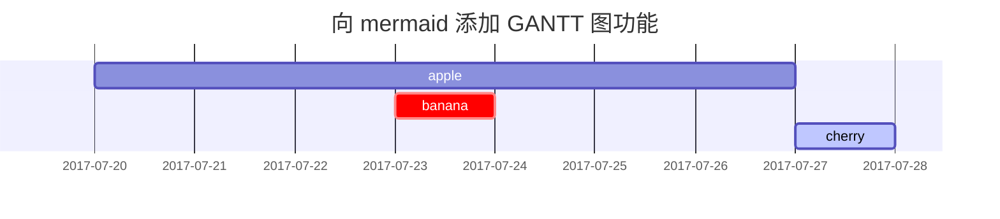

> 官方文章翻译版，版本：chirpy-7.4.1
{: .prompt-info }

## 标题（Headings）

# H1 — 一级标题

{: .mt-4 .mb-0 }

## H2 — 二级标题

{: data-toc-skip='' .mt-4 .mb-0 }

### H3 — 三级标题

{: data-toc-skip='' .mt-4 .mb-0 }

#### H4 — 四级标题

{: data-toc-skip='' .mt-4 }

------

## 段落（Paragraph）

鹅城的火车一停，规矩就开始变得不太规矩。新来的县长骑在马上，看似两袖清风，实则心里算盘打得比谁都响；黄四郎坐在高楼里喝茶，笑得温和，却早把街上的每一条路都标好了价码。百姓夹在中间，看热闹，也看命运。有人以为枪在谁手里，理就在哪一边；也有人明白，真正要命的不是子弹，而是没得选。风声一紧，枪声一响，旧秩序碎了一地，新的故事才刚刚开始。

（以上为示例占位文本，用于演示段落排版效果。）

------

## 列表（Lists）

### 有序列表（Ordered list）

1. 第一项
2. 第二项
3. 第三项

### 无序列表（Unordered list）

- 章节
  - 小节
    - 段落

### 待办事项列表（ToDo list）

-  任务
  -  步骤 1
  -  步骤 2
  -  步骤 3

### 描述列表（Description list）

Sun
: 围绕地球运行的恒星

Moon
: 地球的天然卫星，通过反射太阳光可被观测到

------

## 引用块（Block Quote）

> 这一行用于展示 *引用块（block quote）* 的效果。

------

## 提示块（Prompts）

> 一个 `tip` 类型提示的示例。
{: .prompt-tip }

> 一个 `info` 类型提示的示例。
{: .prompt-info }

> 一个 `warning` 类型提示的示例。
{: .prompt-warning }

> 一个 `danger` 类型提示的示例。
{: .prompt-danger }

------

## 表格（Tables）

| 公司名称                     | 联系人           | 国家   |
| ---------------------------- | ---------------- | ------ |
| Alfreds Futterkiste          | Maria Anders     | 德国   |
| Island Trading               | Helen Bennett    | 英国   |
| Magazzini Alimentari Riuniti | Giovanni Rovelli | 意大利 |

------

## 链接（Links）

[http://127.0.0.1:4000](http://127.0.0.1:4000/)

------

## 脚注（Footnote）

点击标记可跳转到脚注说明[^footnote]，这里还有另一个脚注[^fn-nth-2]。

------

## 行内代码（Inline code）

这是一个 `行内代码（Inline Code）` 的示例。

------

## 文件路径（Filepath）

这是一个文件路径示例：`/path/to/the/file.extend`{: .filepath}。

------

## 代码块（Code blocks）

### 通用代码块

```text
这是一个普通的代码块示例，不包含语法高亮和行号。
```

### 指定语言的代码块

```bash
if [ $? -ne 0 ]; then
  echo "命令执行失败";
  # 执行必要的处理 / 或直接退出
fi;
```

### 指定文件名的代码块

```sass
@import
  "colors/light-typography",
  "colors/dark-typography";
```

{: file='_sass/jekyll-theme-chirpy.scss'}

------

## 数学公式（Mathematics）

数学公式由 [**MathJax**](https://www.mathjax.org/) 提供支持：

$$
\begin{equation}
\sum_{n=1}^\infty 1/n^2 = \frac{\pi^2}{6}
\label{eq:series}
\end{equation}
$$

我们可以通过 \eqref{eq:series} 来引用上述公式。

当 $a \ne 0$ 时，二次方程 $ax^2 + bx + c = 0$ 有两个解：

$$ x = {-b \pm \sqrt{b^2-4ac} \over 2a} $$

------

## Mermaid SVG 图表



------

## 图片（Images）

### 默认样式（带说明文字）

{: width="972" height="589" }
*全宽显示并居中对齐*

------

### 左对齐

{: width="972" height="589" .w-75 .normal}

------

### 左浮动

{: width="972" height="589" .w-50 .left}
Ubuntu 22.04 LTS（Jammy Jellyfish)是一款长期支持版本，官方提供长达五年的安全更新与维护，适合服务器部署和日常开发使用。该版本默认内核更新、系统稳定性提升，并在性能与安全性之间取得了良好平衡。对于开发者而言，Ubuntu 22.04 在包管理、容器生态以及主流开发语言支持方面表现成熟，既适合作为本地开发环境，也适合运行在 WSL2、云服务器或虚拟化平台中，能够满足从学习到生产的多种使用场景。

------

### 右浮动

{: width="972" height="589" .w-50 .right}
Ubuntu 22.04 LTS（Jammy Jellyfish)是一款长期支持版本，官方提供长达五年的安全更新与维护，适合服务器部署和日常开发使用。该版本默认内核更新、系统稳定性提升，并在性能与安全性之间取得了良好平衡。对于开发者而言，Ubuntu 22.04 在包管理、容器生态以及主流开发语言支持方面表现成熟，既适合作为本地开发环境，也适合运行在 WSL2、云服务器或虚拟化平台中，能够满足从学习到生产的多种使用场景。

------

### 深色 / 浅色模式与阴影

下方图片会根据主题偏好自动切换深色 / 浅色模式，并带有阴影效果：

{: .light .w-75 .shadow .rounded-10 w='1212' h='668' }
{: .dark .w-75 .shadow .rounded-10 w='1212' h='668' }

------

## 视频（Video）



------

## 反向脚注

[^footnote]: 脚注来源说明
[^fn-nth-2]: 第二条脚注来源说明
